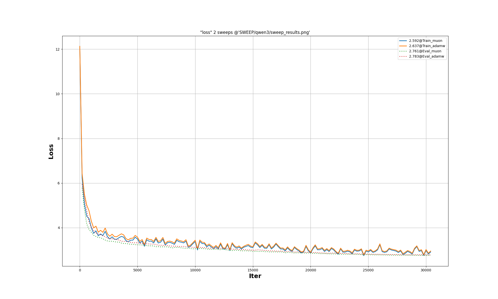

## 1. Download project & build
```bash
git clone https://github.com/gruai/koifish
cd koifish
mkdir build && cd build && cmake ..
make clean && make -j$(nproc)
```

## 2. Datasets & Tokenizer   

The datasets for this tutorial comes from [gvlassis/ClimbMix10M](https://huggingface.co/datasets/gvlassis/ClimbMix10M), which is a refined [ClimbMix](https://arxiv.org/abs/2504.13161) datasets. 

After download this data to some local dir,  The [PreTokenizer](py-models/PreTokenizer.py) script provides a utility to prepare token files for training.
```shell
python ./py-models/PreTokenizer.py ./Models/Qwen3-0.6B/ --dataset climb-10b --localdir ./Datasets/climb_lite --outdir ./Datasets/climb_lite/output 
```
This will create 100 `*train*.bin` file each contain 100M tokens and 1 eval file `eval.bin`. 
This tutorial only use 1B(10 file) tokens as the follwoing json:
```json
    "datasets":{
        "train":{
            "glob":"./Datasets/climb-1b/*train*.bin","most":10,"name":"climb"
        },        
        "eval_1": {"glob":"./Datasets/tiny-shakespeare/*val*.bin","name":"shake","most":10,"eval-every":500 ,"samp":0.1       }
    },
```
There also one more tokenizer file "tokenizer.dat", it includes a large mapping table(map integer tokens to string pieces) for decoding. It also contains more metadatas of tokenizer.

## 3. Enviroment
1) Linux x86 64bit Ubuntu 22.04 with CUDA 12
2) Install CUDNN & cudnn-frontend
```shell
wget https://developer.download.nvidia.com/compute/cuda/repos/ubuntu2204/x86_64/cuda-keyring_1.1-1_all.deb
sudo dpkg -i cuda-keyring_1.1-1_all.deb
sudo apt-get update
sudo apt-get -y install libcudnn9-dev-cuda-12

# "install" cudnn-frontend to ~/
git clone https://github.com/NVIDIA/cudnn-frontend.git
```

## 4. Train 
```shell
    ./bin/koifish ./cases/qwen3/qwen3_0.6B.json
```
   
## 5. Results
The training process takes several hours/days, depending on the model & GPU. In my PC(only one 4090-24G GPU), it takes about 14 hours(~20k tokens per second) to train QWen3-0.6B model.
   
### Results of QWen3-0.6B 
[Json config file](../qwen3/qwen3_0.6B.json)

[Training log file](../qwen3/R_0120_adamw.info)

The following figure lists the curves of the training process:
.