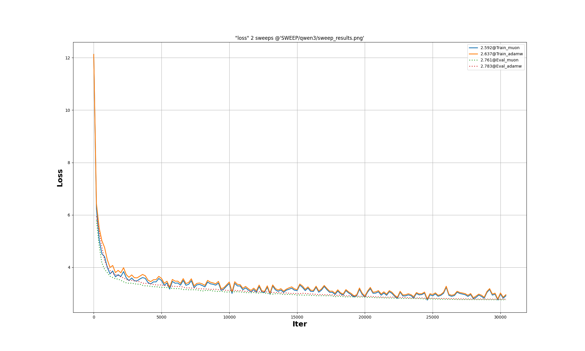

## 1. Download project & Build
```bash
git clone https://github.com/gruai/koifish
cd koifish
mkdir build && cd build && cmake ..
make clean && make -j$(nproc)
cd ..
```
If everything is OK, the compiled program is located in *./bin* directory.
```shell
(base) root@ubuntu22:~/koifish# ll ./bin/koifish 
-rwxr-xr-x 1 root root 19898896  0126 17:52 ./bin/koifish*
```

## 2. Datasets & Tokenizer   

The dataset for this tutorial comes from [gvlassis/ClimbMix10M](https://huggingface.co/datasets/gvlassis/ClimbMix10M), which is a refined [ClimbMix](https://arxiv.org/abs/2504.13161) dataset. Once you download the data to a local directory, the [PreTokenizer](../../py-models/PreTokenizer.py) script converts it into token files for training.
Assume the directory of downloaded ClimbMix is *"./Download/ClimbMix"*, and the directory for token files is *"./Datasets/climb-1b"*, then:
```shell
python ./py-models/PreTokenizer.py ./Models/Qwen3-0.6B/ --dataset json_11 --localdir ./assets/chat_data.jsonl --outdir ./Datasets/json_11
```


## 3. Enviroment
1) Linux x86 64bit Ubuntu 22.04 with CUDA 12(12.5+)
2) Install CUDNN & cudnn-frontend
```shell
wget https://developer.download.nvidia.com/compute/cuda/repos/ubuntu2204/x86_64/cuda-keyring_1.1-1_all.deb
sudo dpkg -i cuda-keyring_1.1-1_all.deb
sudo apt-get update
sudo apt-get -y install libcudnn9-dev-cuda-12

# "install" cudnn-frontend to ~/
git clone https://github.com/NVIDIA/cudnn-frontend.git
```

## 4. Pre-Train 
```shell
    ./bin/koifish ./cases/qwen3/qwen3_0.6B.json
```
[Json config file](../qwen3/qwen3_0.6B.json)   

## 5. SFT
```shell
    ./bin/koifish ./cases/qwen3/qwen3_0.6B.json
```
[Json config file](../qwen3/qwen3_0.6B.json)  

## 6. Results
The training process takes 8-16 hours, depending on the model & GPU. In my PC(only one 4090 GPU with 24G memory), it takes about 14 hours(~20k tokens per second) to train QWen3-0.6B model.
   
### Results of QWen3-0.6B 
This [Training log file](../qwen3/R_0120_adamw.info) records my local training process. If you encounter difficulties, please send me detailed log like this file.

The following figure lists the curves of the training process:

There are four curves. Two of them correspond to the AdamW optimizer, and other two correspond to the Muon optimizer. It's clear that Muon optimizer would converge faster and get better results.
