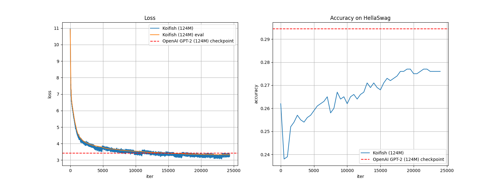
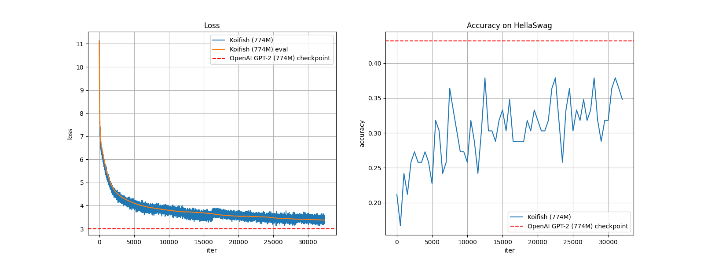

## 1. Download project & build
```bash
    git clone https://github.com/gruai/koifish
    cd koifish
    # build ggml lib first
    cd llama.cpp
    mkdir build && cd build && cmake .. 
    make clean && make VERBOSE=TRUE
    cd ../../

# export CPATH=~/cudnn-frontend/include/:/usr/local/cuda-12.1/include:$CPATH        # maybe need this to export CPATH
    mkdir build && cd build && cmake ..
    make clean && make VERBOSE=TRUE
```
There would be following files in the ./bin directory if everythins is OK.
```shell
~/koifish# ll ./bin/
total 57420
drwxr-xr-x 2 root root      156 Feb 15 15:47 ./
drwxr-xr-x 9 root root      218 Feb 15 15:07 ../
-rwxr-xr-x 1 root root 52481688 Feb 15 15:47 koifish*
-rw-r--r-- 1 root root  2262270 Feb 15 15:34 libcommon.a
-rwxr-xr-x 1 root root   879760 Feb 15 15:33 libggml.so*
-rwxr-xr-x 1 root root  1846848 Feb 15 15:33 libllama.so*
-rwxr-xr-x 1 root root   532928 Feb 15 15:35 libllava_shared.so*
-rw-r--r-- 1 root root   784508 Feb 15 15:35 libllava_static.a
```

## 2. Datasets & Tokenizer   

The datasets for this tutorial comes from [karpathy/fineweb-edu-100B-gpt2-token-shards](https://huggingface.co/datasets/karpathy/fineweb-edu-100B-gpt2-token-shards), which includes about 1000 .bin files. Each file contain 100M tokens.    Thank Andrej K very much for providing this dataset!

This tutorial only use 1B(10 file) tokens.
* Training files:        edu_fineweb_train_000001.bin ~ edu_fineweb_train_000010.bin
* Evaluate file:         edu_fineweb_val_000000.bin
* Hellaswag file:        hellaswag_val.bin
For the detail of how tokenize texts to generate these tokens, please visit https://github.com/karpathy/llm.c/discussions/481 

As the following json configuration shows, Koifish supports multiple evaluation datasets. It would load token files from user specified folder. In this configuration, "most"=10, so Koifish would only load at most 10 train*.bin files from /hy-tmp/edu_fineweb/. 
```json
    "datasets":{
        "train":{
            "glob":"/hy-tmp/edu_fineweb/*train*.bin",  "most":10,        "name":"edu_fineweb1B"
        },
        "eval_1": {"glob":"/hy-tmp/edu_fineweb/*val*.bin","name":"edu_fineweb1B","eval-every":100        },
        "eval_2":{"glob":"/hy-tmp/hellaswag_val.bin", "type":"hellaswag","eval-every":500        }
    },
```

## 3. Enviroment
1) Linux x86 64bit Ubuntu 22.04 with CUDA 12
2) Install CUDNN & cudnn-frontend
```shell
wget https://developer.download.nvidia.com/compute/cuda/repos/ubuntu2204/x86_64/cuda-keyring_1.1-1_all.deb
sudo dpkg -i cuda-keyring_1.1-1_all.deb
sudo apt-get update
sudo apt-get -y install libcudnn9-dev-cuda-12

# "install" cudnn-frontend to ~/
git clone https://github.com/NVIDIA/cudnn-frontend.git
```

## 4. Train 
```shell
    ./bin/koifish ./cases/gpt2/gpt2_124M.json
    ./bin/koifish ./cases/gpt2/gpt2_774M.json
```
The gpt2_124M/774M.json is a configuration file as follows, which includes the model and training parameters.
```json
{        
    "version":"0.1.0",     
    "arch":"GPT2",
    "datasets":{
        "train":{
            "glob":"/hy-tmp/edu_fineweb/*train*.bin",  "most":10,        "name":"edu_fineweb1B"
        },
        "eval_1": {"glob":"/hy-tmp/edu_fineweb/*val*.bin","name":"edu_fineweb1B","eval-every":100        },
        "eval_2":{"glob":"/hy-tmp/hellaswag_val.bin", "type":"hellaswag","eval-every":500        }
    },
    
    "train": {
        "save-every":500,
        "dump-every":10,
        
        "gpt-every":-10,
        "epoch":2,
        "batch":80,
        "learning-rate":0.0006,  

        "optimizatioin":{
            "#method":"adamw sgdv hsgd",
            "method":"adamw",
            "sign":0,
            "grad_accumulation":1,
            "lars_ratio":0,      "ZMUV_ratio":0.00    
        }              
    },  

    "model":{      
        "parameter":{
            "Layer": 12,  
            "transformer":{
                "Ctx":1024,  "Embed":    768,    "Head": 12,   "Ffn":3072,
                "on":[""]
            }
        },  
        "inp_embd": {"Embedding+":[]},    
        "layer":  {      
            "attn":{"QKV":[]},               
            "ffn":{"FFN":[]},       
            "# gattn":{"GAU":[]}
                                  
        },
        "last_normal":{"Normal":[]},
        "out": {"CLASIFY":[]}
    },

    "#checkpoint-in":"./hy-tmp/checkpoint/chk-GPT2_2001.gguf",
    "#checkpoint-out":"./hy-tmp/checkpoint/chk-GPT2_",
    "# model-out":"gpt2_cys.gguf",    

    "threads":20,            
    "seed":42
}
```
   
## 5. Results
The training process takes several hours/days, depending on the model & GPU. In my PC(only one 3090-24G GPU), it takes about 7 hours(~72k tokens per second) to train 124M model.
Koifish would save each step info to three csv files:
* Train@[data_set_name]_info_.csv 
* Eval@[data_set_name]_info_.csv 
* Eval@[HellaSwag]_info_.csv

### Results of GPT2-124M 
[Json config file](./gpt2/gpt_124M.json). Model parameters:
    The loss curve is as follows:
.

   
### Results of GPT2-774M 
[Json config file](./gpt2/gpt_774M.json).Model parameters:
The loss curve is as follows:
.